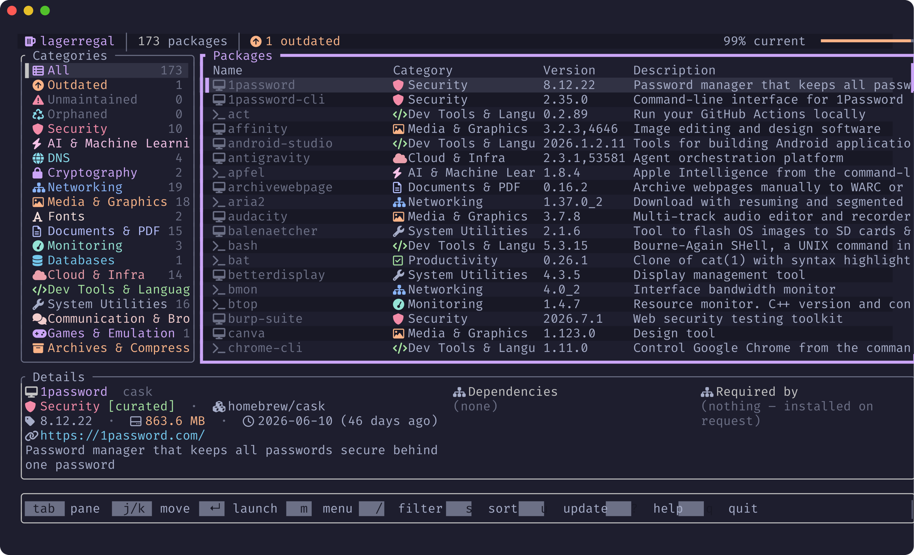

# homebrew-tap

[admonstrator](https://github.com/admonstrator)'s personal [Homebrew](https://brew.sh) tap — one place for every CLI and app I distribute via `brew`.

## Usage

```sh
brew tap admonstrator/tap
brew trust admonstrator/tap
brew install <formula>
```

Or install directly without a persistent tap:

```sh
brew install admonstrator/tap/<formula>
```

## What's in here

| Formula | Description |
|---|---|
| [`lagerregal`](https://github.com/admonstrator/homebrew-lagerregal) | Classify, search and manage your installed Homebrew packages by category — a fast CLI and TUI with notes, snapshots and housekeeping views |

[](https://brew.admon.me/lagerregal/)

Each formula's actual source lives in its own repository; the generated `Formula/*.rb` files here are what `brew` reads. Formulae are regenerated automatically by each project's release workflow — don't hand-edit them, changes will be overwritten on the next release.

## Website

A short overview also lives at [brew.admon.me](https://brew.admon.me), built from [`site/`](site) and published via GitHub Pages.

## License

MIT
